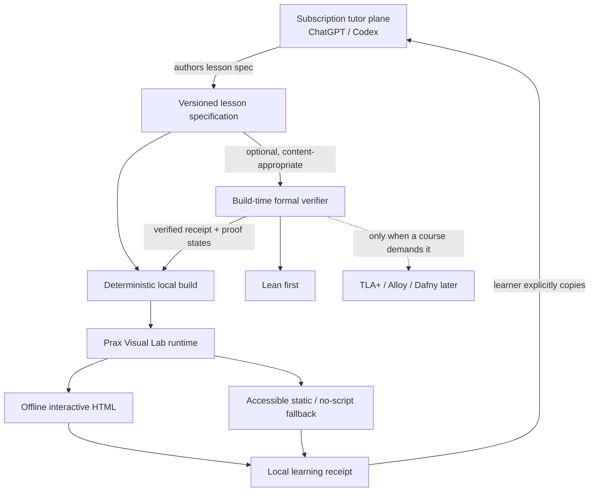
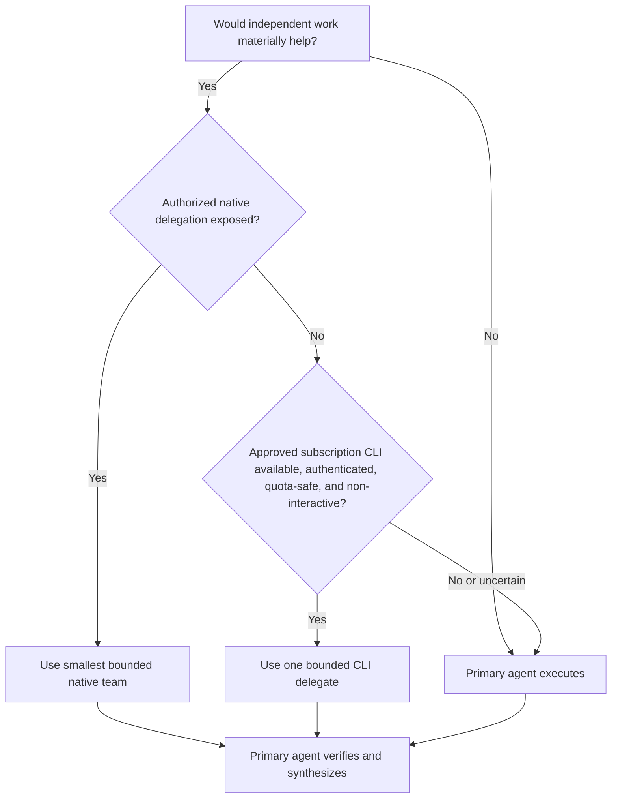
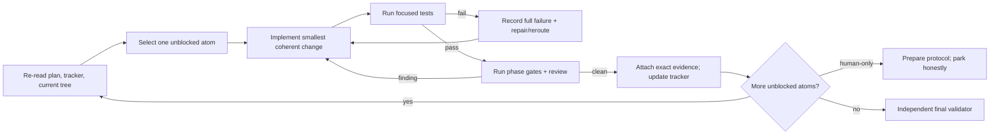

# Prax Teach v2 — Zero-API Visual Runtime Upgrade

> **Canonical implementation plan · 2026-08-05**  
> Build an immersive, deterministic local visual-learning runtime around `prax-teach-v2`, while keeping ChatGPT/Codex as a human-operated subscription tutor—not a hidden API.

## Executive decision

Build **Prax Visual Lab** as a separately versioned, tested local runtime inside the `prax-teach-v2` candidate. Keep the existing static renderer as the universal fallback. Add one optional **Lean build-time adapter** only after the visual runtime proves reusable. Make agent execution **capability-adaptive**: the skill describes roles, evidence, budgets, and authorization boundaries; each harness decides how to provide them.

The plan is intentionally ambitious about learner experience and intentionally conservative about claims, cost, privacy, and formal-method scope.

### What “100% complete” means

There are two completion lines, and they must never be conflated:

1. **Engineering complete:** every in-scope runtime, lesson, security, accessibility, deterministic-build, test, review, packaging, and documentation criterion passes on the exact candidate bytes.
2. **North Star demonstrated:** real learners also pass the predeclared immediate, delayed 7–14 day, and novel-transfer gates.

An autonomous agent can finish the first line. It can prepare and analyze the second, but it cannot fabricate participants, time delays, accessibility field use, or learning outcomes. Until those observations exist, the only honest terminal state is:

```text
ENGINEERING_COMPLETE / SCIENTIFIC_EVIDENCE_PENDING
```

The stronger `UPGRADE_100_PERCENT_VERIFIED` state is reserved for exact-byte engineering closure **and** genuine external learner evidence.

## North Star and upgrade outcome

> The learner can later retrieve, explain, apply, discriminate, and transfer the idea without the tutor—and the system can show honest evidence for that claim.

The upgrade should make that outcome more likely by letting learners predict, manipulate, compare, step through, explain, and transfer—not by adding decoration.

At the end of the upgrade:

- a learner can use three substantially different interactive lessons entirely offline;
- each lesson preserves an accessible static/no-script route;
- local interaction emits an inspectable, deletable learning receipt;
- the learner deliberately copies that receipt to ChatGPT/Codex when human-like interpretation is useful;
- the runtime never calls OpenAI or any model provider;
- formal verification is an optional authoring-time evidence source, not an omnipresent learner dependency;
- the teaching skill adapts to the host harness without hardcoded model or CLI commands;
- every completion claim points to exact evidence.

## Non-negotiable constraints

| Boundary | Required behavior |
|---|---|
| Model cost | No API key, API billing, metered model backend, or hidden pay-as-you-go route |
| Subscription use | Human-operated ChatGPT/Codex and explicitly authorized subscription-backed tooling only |
| Runtime network | Zero requests, zero telemetry, zero CDN, zero remote fonts, zero cloud dependency |
| Learner data | Local by default; explicit export/import; inspectable and deletable; no silent upload |
| Accessibility | WCAG 2.2 AA engineering target, COGA-aware design, keyboard path, zoom/reflow, reduced motion, no-script fallback, and field evidence kept separate |
| Truthfulness | Synthetic, agent, fixture, and automated results never become human-learning claims |
| Portability | Core policy names capabilities and invariants—not provider-specific commands |
| Delegation | Smallest useful, authorized, bounded delegation; primary agent owns synthesis and evidence |
| Release | No canonical install, merge, push, deploy, or replacement without the explicit promotion gate |

## System architecture



### Plane A — subscription tutor and authoring

The host conversation remains responsible for:

- natural-language teaching and Socratic dialogue;
- interpreting open explanations;
- diagnosing misconceptions;
- progressive feedback and alternative examples;
- authoring and reviewing lesson specifications;
- interpreting a receipt only when the learner deliberately shares it.

The subscription is **not** a programmatic runtime backend. Do not automate the ChatGPT browser, scrape the product, or disguise subscription access as an API.

### Plane B — local deterministic visual learning

The local artifact owns:

- state transitions and learner-controlled stepping;
- exact calculations and structural checks;
- parameter manipulation and synchronized views;
- predefined, ordered hints;
- deterministic feedback for exact/structural tasks;
- local ephemeral state and explicit receipt import/export;
- accessible static and print equivalents.

It does not claim to understand arbitrary natural language.

### Communication boundary

The bridge between planes is an explicit, inspectable receipt:

```json
{
  "schema_version": "prax.learning-receipt/v1",
  "lesson_id": "python-float-001",
  "lesson_version": "1.0.0",
  "attempts": 3,
  "prediction": "0.3 exactly",
  "observed_result": "0.30000000000000004",
  "highest_hint_level": 1,
  "learner_explanation": "0.1 cannot terminate in binary",
  "transfer": { "item_id": "float-transfer-02", "result": "pass" },
  "created_at": "2026-08-05T14:20:00+05:30"
}
```

The runtime must support copy, JSON download, JSON import, inspect, and delete. Automatic upload is forbidden.

## Target repository shape

The exact tree may be adjusted by a small ADR if current repository constraints demand it, but the architectural boundaries may not be collapsed.

```text
prax-teach-v2/
├── SKILL.md
├── references/
│   ├── NO-API-ARCHITECTURE.md
│   ├── CAPABILITY-ADAPTIVE-EXECUTION.md
│   ├── VISUAL-RUNTIME.md
│   └── FORMAL-VERIFICATION.md
├── schemas/
│   ├── visual-lesson.schema.json
│   ├── learning-receipt.schema.json
│   └── formal-verification-receipt.schema.json
├── runtime/
│   └── prax-visual-lab/
│       ├── package.json
│       ├── src/
│       │   ├── core/
│       │   ├── components/
│       │   ├── receipts/
│       │   └── accessibility/
│       ├── tests/
│       └── README.md
├── examples/
│   └── visual-lab/
│       ├── python-floating-point/
│       ├── rubiks-move-lab/
│       ├── lost-update-lab/
│       └── lean-proof-state/
└── integrations/
    └── formal/
        └── lean/
```

`runtime/prax-visual-lab` is independently versioned. The bundled Markdown renderer remains static. If the runtime is absent, incompatible, or unverified, the existing router must continue to fail closed to static/host chat.

## Capability-adaptive agent execution

The core skill must specify behavior, not invocation syntax.

### Decision sequence



### Normative policy

Before delegating, the agent must:

1. identify genuinely independent work;
2. inspect exposed tools and governing policy instead of guessing;
3. verify authorization separately from capability presence;
4. use the smallest useful worker count;
5. assign bounded ownership, evidence, permissions, and a stop condition;
6. prevent recursive delegation unless explicitly supported and authorized;
7. keep private learner data and secrets out of delegate prompts;
8. keep the primary agent accountable for integration, testing, truthfulness, accessibility, and final claims;
9. continue single-agent without lowering quality when delegation is unavailable.

Provider- or harness-specific examples may live in a non-normative reference. They must be labeled as examples and verified against current help before use.

### Cost and quota shield

For this upgrade:

- default to one primary agent;
- use at most two native subagents concurrently, depth one;
- default external CLI delegates to zero; maximum one at a time and two total for the entire run;
- use no broad council and no recursive CLI-to-CLI delegation;
- use a delegate only for an isolated task with a measurable payoff;
- stop identical retries after three failures, preserve the full failure evidence, and reroute;
- allow at most two review-repair rounds per phase unless a new failing test introduces new evidence;
- never spend separate API credits;
- if authentication mode or quota impact is uncertain, do not invoke the tool.

## Learning-experience design language

Every interactive lesson must follow the same cognitive rhythm:

1. **Orient:** name the observable outcome without revealing the answer.
2. **Predict:** require a meaningful learner commitment.
3. **Manipulate:** expose only controls that change the underlying model.
4. **Compare:** synchronize two or more representations.
5. **Explain:** ask the learner to connect cause and result.
6. **Transfer:** use a structurally related but unfamiliar case.
7. **Reflect:** expose evidence, uncertainty, and the next retrieval horizon.

### Core components

| Component | Learning job | Minimum contract |
|---|---|---|
| `state-stepper` | Traverse causal states one step at a time | Previous/next/jump/reset; stable state labels; URL-free deterministic state; keyboard and static sequence |
| `parameter-lab` | Manipulate one or more variables and see consequences | Native labeled controls; exact value display; reset; announced result; bounded valid ranges |
| `compare-views` | Link symbolic, numerical, spatial, or temporal representations | Synchronized selection; explicit mapping; table/text equivalent; no color-only correspondence |
| `hint-engine` | Reveal the next-needed support after an attempt | Ordered hint levels; one level at a time; no transfer-answer leakage; receipt records highest level |
| `receipt-panel` | Give the learner ownership of evidence | Preview, copy, download, import validation, delete, and plain-language privacy statement |

### Visual quality rules

- Interaction exists only when learner control changes understanding.
- Motion explains a change; it never runs merely for atmosphere.
- Every animation has pause/replay or step control and a reduced-motion equivalent.
- Exact labels, equations, geometry, data, and state remain semantic and machine-checkable.
- Each view answers one learner question; synchronized views make mappings explicit.
- Progressive disclosure reduces overload without hiding accessibility information.
- Delight comes from agency, surprise, responsive explanation, and earned progress—not points, confetti, or manipulative streaks.
- The artifact never leaks retrieval answers through captions, defaults, DOM order, source data shown before attempt, thumbnails, or static fallbacks.

## Phased delivery plan

### Phase 0 — Freeze, measure, and enforce the no-API boundary

**Purpose:** establish the exact baseline and make forbidden runtime behavior mechanically testable.

Deliver:

- current-tree inventory, HEAD, dirty-state, toolchain, and static-route baseline;
- `NO-API-ARCHITECTURE.md` with threat model and trust boundaries;
- dependency and asset allowlist;
- strict local CSP suitable for built artifacts;
- network interception test that fails on any request;
- no telemetry, API-key, CDN, remote font, service-worker update, or dynamic import path;
- local-data, consent, export, and deletion policy;
- the lesson and learning-receipt schemas;
- frozen static comparison lesson and baseline learner-task protocol.

Exit gates:

- `ZV-00` through `ZV-05` pass;
- JavaScript-disabled content remains usable;
- an attempted network call makes verification fail;
- current static behavior remains unchanged.

### Phase 1 — One bounded Python floating-point pilot

**Purpose:** prove the complete learner loop with the smallest reusable runtime surface.

Build only:

- runtime package scaffold;
- `state-stepper`;
- `receipt-panel`;
- ordered hint state;
- one floating-point lesson;
- deterministic static/no-script fallback;
- browser, keyboard, reduced-motion, zoom/reflow, print, and answer-leakage tests.

Lesson sequence:

1. predict whether `0.1 + 0.2` equals `0.3` exactly;
2. construct the binary fraction through repeated steps;
3. compare decimal intent, stored approximation, and evaluated result;
4. move a rounding boundary;
5. explain how representation produces the discrepancy;
6. solve an unfamiliar floating-point transfer case;
7. export and inspect the receipt.

Stop rule: do not build the MVP components until the pilot passes its usability walkthrough, accessibility engineering gates, receipt round-trip, deterministic rebuild, and independent review.

### Phase 2 — Reusable visual-runtime MVP

**Purpose:** test the abstraction across different domains instead of overfitting to one lesson.

Add:

- `parameter-lab`;
- `compare-views`;
- shared `hint-engine`;
- exact and structural graders with explicit limits;
- lesson-spec validator and deterministic build manifest;
- receipt import/export migration and corruption handling.

Then build:

- **Rubik’s move laboratory:** manipulate a legal cube state, compare notation/permutation/spatial views, and test a novel move sequence;
- **Lost-update laboratory:** interleave two operations, compare timelines and state tables, identify the race, and transfer to an unfamiliar schedule.

MVP exit gate:

- all three lessons use the shared components without lesson-specific forks in core logic;
- all work offline from a local server and packaged artifact;
- the no-script route preserves the complete conceptual sequence;
- property tests cover cube invariants, state-stepper transitions, receipt round trips, and concurrency schedules;
- a manual browser matrix is recorded honestly.

### Phase 3 — One Lean build-time experiment

**Purpose:** measure whether formal verification adds trustworthy teaching value without infecting ordinary lessons with formal complexity.

Deliver:

- an ADR explaining why Lean is selected and what would make it removable;
- a pinned local Lean toolchain and dependency manifest;
- one small theorem lesson;
- formal-verification receipt schema and validator;
- proof-state JSON export;
- visual proof-state playback with static equivalent;
- exact source, toolchain, imports, axioms, warnings, and hash provenance.

The browser does not contain a live Lean engine. The build checks Lean; the artifact visualizes preverified states.

Keep Lean only if it:

- catches or prevents a material content error, or
- produces a proof-state representation learners can use,

without unacceptable authoring, build, maintenance, accessibility, or cognitive cost. Otherwise retain the generic formal-receipt interface and remove/defer the adapter.

TLA+, Alloy, Dafny, Agda, and F* are explicitly out of scope. Add one later only when a named course, misconception, and evaluation plan justify it.

### Phase 4 — Evaluation and honest evidence

**Purpose:** decide whether the runtime helps learning instead of merely looking impressive.

Engineering evaluation:

- predeclare outcomes, exclusions, stopping rules, and hard failures;
- compare the frozen static lesson against the interactive pilot;
- record task completion, error recovery, hint use, answer leakage, build determinism, bundle size, and accessibility findings;
- blind artifact review where practical;
- keep synthetic machinery results labeled synthetic.

Human evaluation:

- small think-aloud pilot for comprehension and confusion;
- representative keyboard, zoom, reduced-motion, and assistive-technology field checks;
- immediate retrieval/explanation/application/discrimination/transfer measures;
- delayed 7–14 day unassisted retrieval and novel transfer;
- qualitative evidence about agency, cognitive load, trust, and fun.

Hard failures:

- inaccessible essential control;
- runtime network request or telemetry;
- answer leakage before attempt;
- receipt loss, cross-lesson corruption, or silent upload;
- animation with no equivalent path;
- false mastery or human-learning claim;
- non-deterministic exact output;
- failure to preserve static fallback.

### Phase 5 — Selective optimization and expansion

Only after Phase 4 shows a real bottleneck:

- use SkillOpt against a frozen, representative teaching benchmark—not subjective prompt preference;
- accept an instruction edit only when it beats the baseline and all hard gates;
- use Flint only when a chart is the right semantic job and the accessible table remains primary evidence;
- add another formal backend only for a named content need;
- add components only when two or more lessons need the same learner action.

No automatic self-rewriting, optimizer, formal language, or visualization library belongs in the default runtime merely because it exists.

## Verification strategy

### Test pyramid

| Layer | Evidence |
|---|---|
| Schema | positive/negative fixtures; unknown-field and version rejection; stable canonical serialization |
| Unit | reducers, state transitions, graders, hint order, receipt validation, deletion, migrations |
| Property | state-stepper reachability, cube invariants, schedule interleavings, receipt round trips, idempotent builds |
| Integration | lesson spec → build → artifact → receipt; static fallback; formal receipt → proof-state artifact |
| Browser | Chromium/WebKit/Firefox where available; keyboard-only; JS-off; CSP; no-network interception; print; reduced motion |
| Accessibility | semantic structure, focus order, names, contrast, zoom/reflow, screen-reader walkthrough, COGA checks |
| Security/privacy | CSP, dependency audit, no secrets, no unexpected storage, corrupt import isolation, HTML injection fixtures |
| Determinism | two clean builds produce identical declared artifacts and manifests |
| Review | independent code, architecture, learning design, accessibility, privacy, and claim review on exact bytes |
| Human learning | predeclared immediate and delayed outcomes; never substituted by agent scores |

### Required browser matrix

At minimum, record:

- one current Chromium-family browser;
- WebKit/Safari behavior on macOS;
- Firefox when available;
- keyboard-only route;
- 200% and 400% zoom/reflow;
- `prefers-reduced-motion`;
- JavaScript disabled;
- one screen-reader walkthrough on macOS;
- print/PDF static result.

A missing environment is `UNVERIFIED`, not `PASS`.

### Exact-byte receipts

Every phase receipt must bind:

- repository HEAD and dirty-state;
- source and artifact hashes;
- dependency lock hash;
- commands and exit codes;
- test counts and failures;
- browser/tool versions;
- reviewer identity or harness class;
- criterion IDs satisfied;
- known gaps and parked external gates.

## Acceptance ledger

The tracker is the authoritative mutable status surface: [`09-zero-api-visual-runtime-tracker.json`](./09-zero-api-visual-runtime-tracker.json). Its Markdown and HTML files are generated human views.

| Range | Scope | Completion rule |
|---|---|---|
| `ZV-00`–`ZV-05` | Baseline and no-API foundation | Exact tests prove the boundary and preserve static behavior |
| `ZV-06`–`ZV-13` | Pilot | One complete, accessible, deterministic learner loop passes review |
| `ZV-14`–`ZV-21` | Reusable MVP | Shared runtime succeeds across Python, Rubik’s, and concurrency |
| `ZV-22`–`ZV-25` | Formal experiment | Lean adapter is measured and explicitly kept or reverted |
| `ZV-26`–`ZV-29` | Evaluation machinery | Protocols, analysis, and evidence separation are executable |
| `EG-ZV-01`–`EG-ZV-04` | External learner evidence | Real accessibility, immediate, delayed, and generalization evidence |
| `ZV-30`–`ZV-35` | Final verification and packaging | Immutable validation, review, docs, archive, and exact receipt |

## Autonomous implementation loop

The execution artifact is [`10-zero-api-autonomous-goal.md`](./10-zero-api-autonomous-goal.md). Its loop is deliberately durable and bounded:



Each iteration works on one acceptance atom, updates durable state, and leaves a reproducible next action. Fresh context is preferred when the harness supports it; continuity lives in the plan, tracker, `SPEC.md`, `prd.json`, progress log, and exact evidence—not in conversational memory.

## Promotion and rollback

### Promotion gate

The candidate may be proposed for canonical installation only when:

- all engineering criteria are `verified` on one exact clean HEAD;
- independent final validation recomputes the receipts;
- no critical or high review finding remains;
- static behavior and rollback package are preserved;
- the user explicitly approves promotion.

Merge, push, deployment, canonical skill replacement, and global installation are separate gated actions.

### Rollback

- Keep the existing static renderer and route contract intact.
- Package the runtime separately so it can be removed without invalidating ordinary teaching.
- Keep lesson specs and receipts versioned and migratable.
- On runtime validation failure, route to static/host chat and expose the reason.
- On a formal-adapter failure, preserve the ordinary lesson and mark formal verification unavailable.

## Explicit non-goals

- an embedded AI chatbot;
- API keys or model-provider SDKs;
- browser automation of ChatGPT as a backend;
- a live Lean engine in every artifact;
- implementations of every proof or specification language;
- VR/AR, 3D spectacle, badges, streaks, leaderboards, or ambient animation;
- a new DSL for one lesson;
- automatic optimizer-driven instruction mutation before a benchmark exists;
- claiming the North Star from synthetic tests or agent review;
- replacing the current skill before exact verification and explicit approval.

## Deliverables

1. Versioned `prax-visual-lab` runtime and documented boundary.
2. No-API architecture, capability-adaptive execution, visual-runtime, and formal-verification references.
3. Lesson, learning-receipt, and formal-receipt schemas with fixtures.
4. Five core components with static equivalents.
5. Python floating-point, Rubik’s move, and lost-update lessons.
6. One keep-or-revert Lean build-time experiment.
7. Deterministic builders, validators, browser/accessibility/security/property tests, and exact receipts.
8. Predeclared learner-study protocol and analysis path.
9. Canonical tracker JSON with synchronized Markdown and HTML views.
10. Copy-paste autonomous `/goal` command with budget, authorization, test, review, and truthfulness gates.

## Final success statement

This upgrade is successful when it creates a delightful local laboratory that helps learners form and test mental models, remains useful and accessible without JavaScript or a model backend, respects subscription and privacy boundaries, adapts across agent harnesses, and can support—not merely assert—the Prax Teach North Star.

The system earns the word **complete** only at the evidence level it actually reached.
